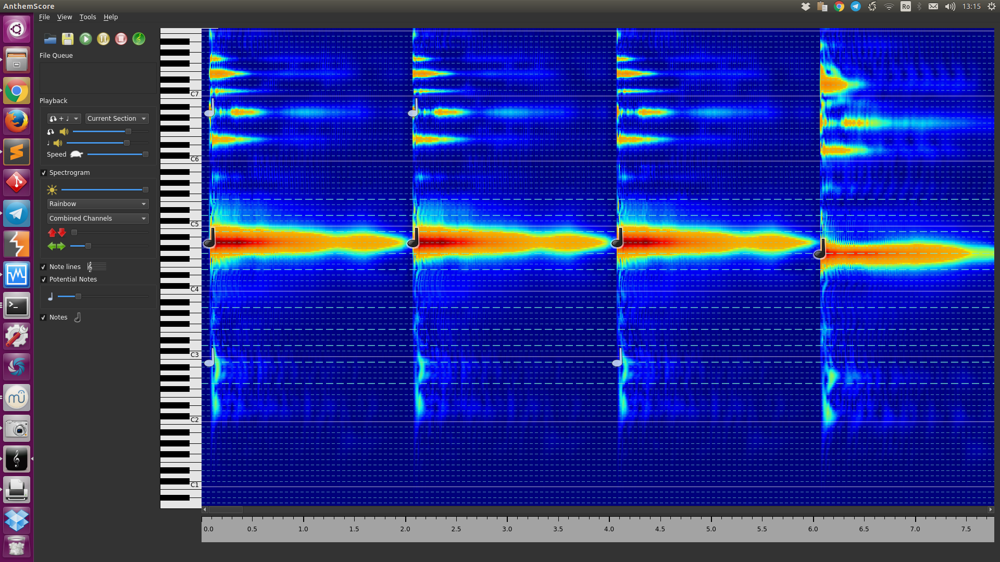
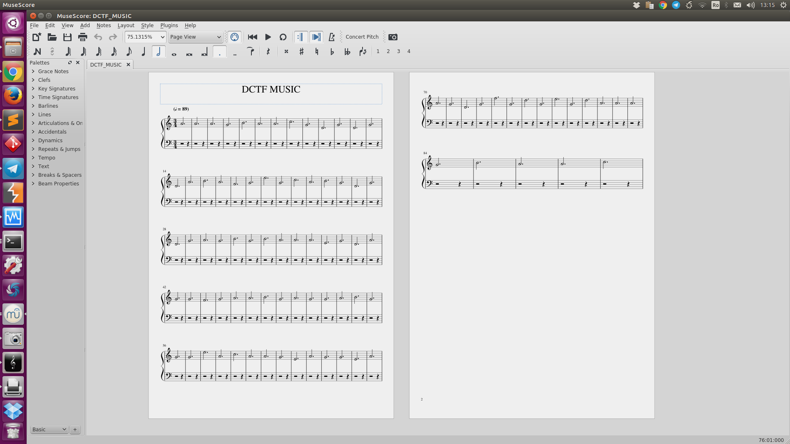
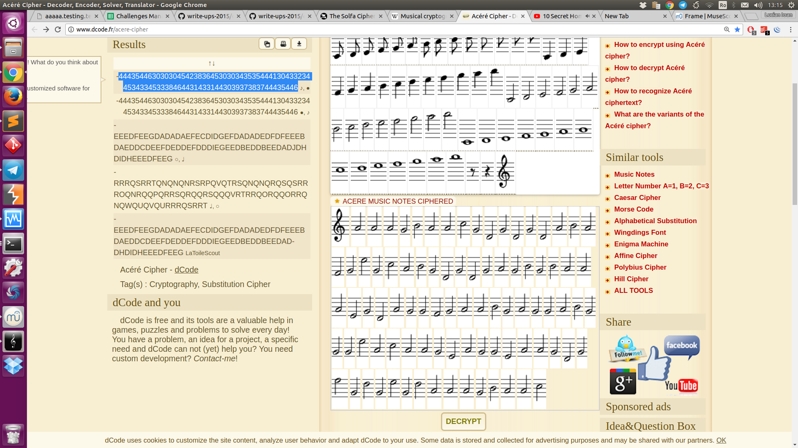

## Caesar's favorite song

### Description:
Do you like it?
Warning! It's not a standard flag. The flag format is: "DCTF" + + "DCTF". 

(https://dctf.def.camp/finals-2017-lpmjksalfka/killthegauls.mp3)

### Author: 
Lucian Nitescu

### Stats: 
374 point / 7 solvers

### Solution:  

The challenge started with this mp3 file:

[killthegauls.mp3](killthegauls.mp3)

We need to obtain the notes of this song so we will use a free version of AnthemScore software.



This will output all the audio notes in MuseScore format.



After that we are deciphering the notes using the Acéré cipher. I used:



We will obtain this "4443544630303045423836453030343535444130433234453433453338464431433144303937383744435446" string which is hex of our flag.

```
lucian@nitescu:~$ python
Python 2.7.12 (default, Nov 19 2016, 06:48:10) 
[GCC 5.4.0 20160609] on linux2
Type "help", "copyright", "credits" or "license" for more information.
>>> buf = "4443544630303045423836453030343535444130433234453433453338464431433144303937383744435446"
>>> buf.decode("hex")
'DCTF000EB86E00455DA0C24E43E38FD1C1D09787DCTF'
>>> 
```

DCTF000EB86E00455DA0C24E43E38FD1C1D09787DCTF