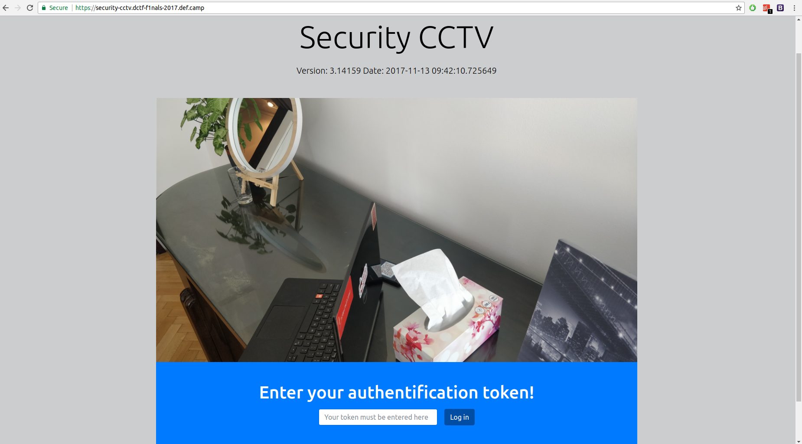
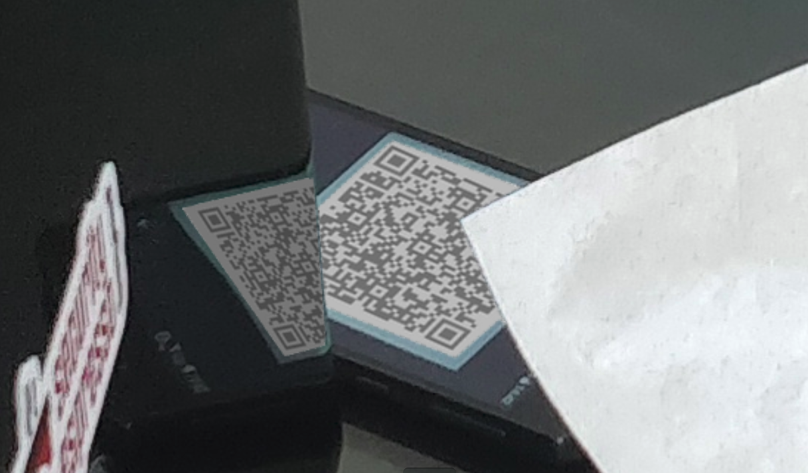
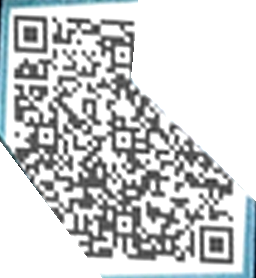
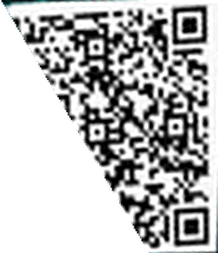
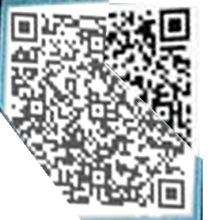

## Security CCTV

### Description:
We really need that token. Can you take it? https://security-cctv.dctf-f1nals-2017.def.camp/.

### Author: 
Lucian Nitescu

### Stats: 
374 point / 7 solvers

### Solution:  

The challenge started with this page:



There you can observe the QR code an his reflection on the laptop:



And also you can observe the time and date (Date: 2017-11-13 09:42:10.725649) which will be changed at every minute with the photo itself. On the server side there is a cron job of a python script which will generate a random QR code which will be inserted in the "frame" image.

Using the following python script we can extract the QR code from the image and retrive the token.

```
import pyqrcode
import string
import random
import png 
import ImageOps
import ImageDraw
import numpy
from PIL import Image, ImageEnhance
import urllib
import qrtools
from qrtools import QR


def transformblit(src_tri, dst_tri, src_img, dst_img):
    ((x11,x12), (x21,x22), (x31,x32)) = src_tri
    ((y11,y12), (y21,y22), (y31,y32)) = dst_tri

    M = numpy.array([
                     [y11, y12, 1, 0, 0, 0],
                     [y21, y22, 1, 0, 0, 0],
                     [y31, y32, 1, 0, 0, 0],
                     [0, 0, 0, y11, y12, 1],
                     [0, 0, 0, y21, y22, 1],
                     [0, 0, 0, y31, y32, 1]
                ])

    y = numpy.array([x11, x21, x31, x12, x22, x32])

    A = numpy.linalg.solve(M, y)

    src_copy = src_img.copy()
    srcdraw = ImageDraw.Draw(src_copy)
    srcdraw.polygon(src_tri)
    transformed = src_img.transform(dst_img.size, Image.AFFINE, A)

    mask = Image.new('1', dst_img.size)
    maskdraw = ImageDraw.Draw(mask)
    maskdraw.polygon(dst_tri, fill=0)

    dstdraw = ImageDraw.Draw(dst_img)
    dstdraw.polygon(dst_tri, fill=(0,0,0,0))
    dst_img.paste(transformed, mask=mask)

def randomg(size=6, chars=string.ascii_uppercase + string.digits):
    return ''.join(random.choice(chars) for x in range(size))
# hell gose lose here
# http://13.81.248.25/qr/img/streamframe.png
urllib.urlretrieve("http://13.81.248.25/qr/img/streamframe.png", "streamframe.png" )
qr = Image.open("streamframe.png").convert("RGBA")
blank = Image.new("RGBA", (4608, 2529), (0,0,0,0))

#Start: Part 1 of the QR code
part1 = qr.crop((2089, 1558, 2358, 1723))
contrast = ImageEnhance.Contrast(part1)
part1 = contrast.enhance(1.6)

part1 = part1.rotate(22, resample=Image.BICUBIC, expand=True)
width, height = part1.size
m = -0.62
xshift = abs(m) * width
new_width = width + int(round(xshift))
part1 = part1.transform((new_width, height), Image.AFFINE,
        (1, m, -xshift if m > 0 else 0, 0, 1.43, 0), Image.BILINEAR)

part1 = part1.resize((285, 285), Image.ANTIALIAS)
part1 = part1.resize((800, 800), Image.ANTIALIAS)


# junk trimming
tri1 = [(10,10), (20,20), (10,20)]
tri2 = [(10,10), (212,100), (208,800)]
transformblit(tri1, tri2, blank, part1)
tri2 = [(150,500), (211,280), (600,800)]
transformblit(tri1, tri2, blank, part1)
tri2 = [(300,420), (470,420), (600,800)]
transformblit(tri1, tri2, blank, part1)
tri2 = [(470,420), (470,100), (900,600)]
transformblit(tri1, tri2, blank, part1)
tri2 = [(100,140), (470,140), (800,10)]
transformblit(tri1, tri2, blank, part1)
tri2 = [(344,218), (365,0), (800,670)]
transformblit(tri1, tri2, blank, part1)
# final trim
part1 = part1.crop((213, 141, 469, 419))

contrast = ImageEnhance.Contrast(part1)
part1 = contrast.enhance(1.5)

#Start: Part 2 of the QR code
part2 = qr.crop((2031, 1584, 2287, 1742))
contrast = ImageEnhance.Contrast(part2)
part2 = contrast.enhance(2.7)

part2 = ImageOps.mirror(part2)


part2 = part2.rotate(0+20-4, resample=Image.BICUBIC, expand=True)

width, height = part2.size
m = -0.49
xshift = abs(m) * width
new_width = width + int(round(xshift))
part2 = part2.transform((new_width, height), Image.AFFINE,
        (1.1, m, -xshift if m > 0 else 0, 0, 1.605, 0), Image.BILINEAR)
part2 = part2.resize((800, 700), Image.ANTIALIAS)
contrast = ImageEnhance.Contrast(part2)
part2 = contrast.enhance(1.2)

part2 = part2.crop((245, 80, 393, 301))
tri1 = [(10,10), (20,20), (10,20)]
tri2 = [(0,0), (0,220), (100,220)]
transformblit(tri1, tri2, blank, part2)
part2 = part2.resize((240, 278), Image.ANTIALIAS)


blank2 = Image.new("RGBA", (278, 278), (0,0,0,0))

contrast = ImageEnhance.Contrast(part2)
part2 = contrast.enhance(1.6)

blank2.paste(part2, (12, 4), part2)
blank2.paste(part1, (0, 0), part1)
blank2.save("./sol.png", "PNG")
part1.save("./part1.png", "PNG")
part2.save("./part2.png", "PNG")


myCode = QR(filename=u"./sol.png")
if myCode.decode():
  print myCode.data_to_string()
```

Example of "phone" QR code retrieval:

```
part1 = qr.crop((2089, 1558, 2358, 1723))
contrast = ImageEnhance.Contrast(part1)
part1 = contrast.enhance(1.6)

part1 = part1.rotate(22, resample=Image.BICUBIC, expand=True)
width, height = part1.size
m = -0.62
xshift = abs(m) * width
new_width = width + int(round(xshift))
part1 = part1.transform((new_width, height), Image.AFFINE,
        (1, m, -xshift if m > 0 else 0, 0, 1.43, 0), Image.BILINEAR)

part1 = part1.resize((285, 285), Image.ANTIALIAS)
part1 = part1.resize((800, 800), Image.ANTIALIAS)


# junk trimming
tri1 = [(10,10), (20,20), (10,20)]
tri2 = [(10,10), (212,100), (208,800)]
transformblit(tri1, tri2, blank, part1)
tri2 = [(150,500), (211,280), (600,800)]
transformblit(tri1, tri2, blank, part1)
tri2 = [(300,420), (470,420), (600,800)]
transformblit(tri1, tri2, blank, part1)
tri2 = [(470,420), (470,100), (900,600)]
transformblit(tri1, tri2, blank, part1)
tri2 = [(100,140), (470,140), (800,10)]
transformblit(tri1, tri2, blank, part1)
tri2 = [(344,218), (365,0), (800,670)]
transformblit(tri1, tri2, blank, part1)
# final trim
part1 = part1.crop((213, 141, 469, 419))

contrast = ImageEnhance.Contrast(part1)
part1 = contrast.enhance(1.5)
```
Result:



Example of "laptop" QR code retrieval:

```
part2 = qr.crop((2031, 1584, 2287, 1742))
contrast = ImageEnhance.Contrast(part2)
part2 = contrast.enhance(2.7)

part2 = ImageOps.mirror(part2)


part2 = part2.rotate(0+20-4, resample=Image.BICUBIC, expand=True)

width, height = part2.size
m = -0.49
xshift = abs(m) * width
new_width = width + int(round(xshift))
part2 = part2.transform((new_width, height), Image.AFFINE,
        (1.1, m, -xshift if m > 0 else 0, 0, 1.605, 0), Image.BILINEAR)
part2 = part2.resize((800, 700), Image.ANTIALIAS)
contrast = ImageEnhance.Contrast(part2)
part2 = contrast.enhance(1.2)

part2 = part2.crop((245, 80, 393, 301))
tri1 = [(10,10), (20,20), (10,20)]
tri2 = [(0,0), (0,220), (100,220)]
transformblit(tri1, tri2, blank, part2)
part2 = part2.resize((240, 278), Image.ANTIALIAS)

```
Result:



Final QR: 



Execution of the python script:

```
lucian@nitescu:~/security-cctv$ python sol.py 
BMQQGBMIBKCIAIJLBOKNIKAACQPPKAJGNCKNBNBHOIJQQPHAHCLPJQHIBJIIQCNKIJJBBNKLJGAQJLHKHIALMBMCN
lucian@nitescu:~/security-cctv$ 
```

After entering the token in less than a minute we get the flag.

DCTF{44c5e6a2ef50636b1d5ad1023bb2c63a5ed62d40549d9edb537c54b4cb72b37e}