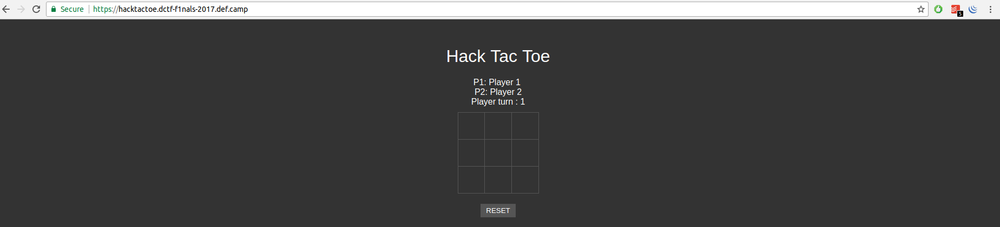
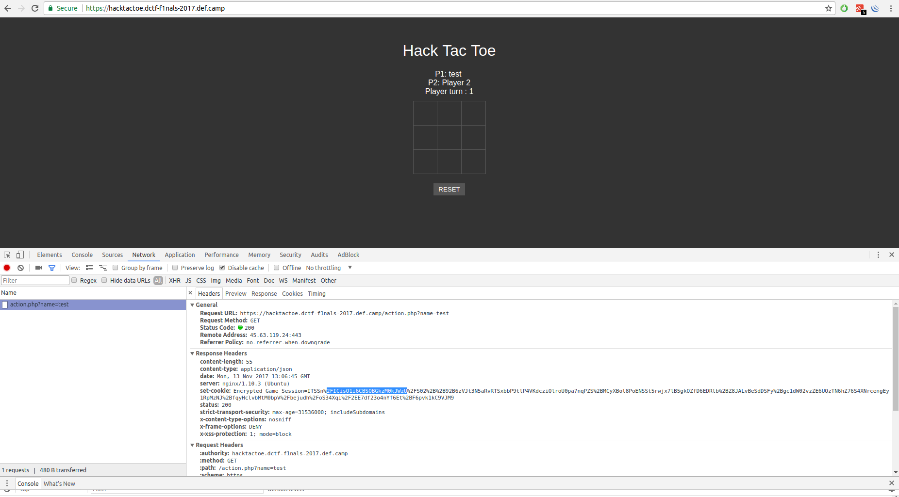
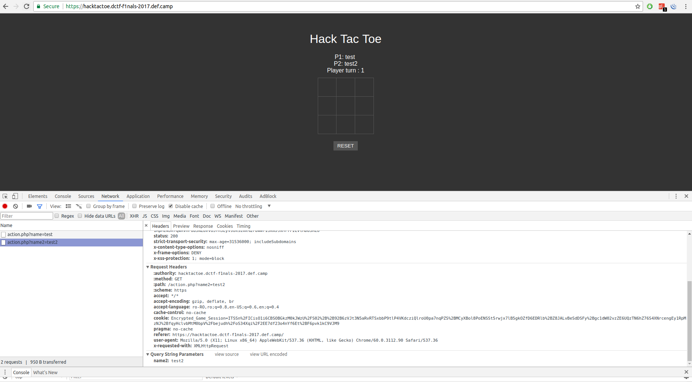

## hack-tac-toe

### Description:
Pair up! Let's play a game of tic tac toe :)

https://hacktactoe.dctf-f1nals-2017.def.camp/

### Author: 
Anatol, Lucian Nitescu

### Stats: 
360 point / 10 solvers

### Solution:  

The challenge started with this simple website:



If we change the name of Player 1 with test we get:



```
Encrypted_Game_Session=ITSSn%2FICisO1i6CBSOBGkzM0kJWzU%2FS02%2B%2B92B6zVJt3N5aRvRTSxbbP9tlP4VKdcziQlroU0pa7nqPZS%2BMCyXBol8PoENSSt5rwjx7lB5gkOZfD6EDRlb%2BZ8JALvBeSdDSFy%2Bgc1dW02vzVE6U0xCF3wtepQJLM%2FJPz1wvpBcUlPIWe%2BkuIza35qoxQ4haIciyc1rNEitX8yqmfTKVfwXo%2BnNazR4rV%2FMqpn0y1RpMpNJee9A%3D%3D
```

If we change the name of Player 2 with test2 we get:



```
Encrypted_Game_Session=ITSSn%2FICisO1i6CBSOBGkzM0kJWzU%2FS02%2B%2B92B6zVJt3N5aRvRTSxbbP9tlP4VKdcziQlroU0pa7nqPZS%2BMCyXBol8PoENSSt5rwjx7lB5gkOZfD6EDRlb%2BZ8JALvBeSdDSFy%2Bgc1dW02vzeG71GqEAOp6WJcbD3j6nG7SmHZKhADqeliXGw94%2Bpxu0ph2SKe32dkLNT3pbizPTPEvRenHosw9boFZLM%2FJPz1wv0B8cya4We4EuCzPyT8NcL9AfHMmuVh7IYise01A%3D%3D
```
Under the Encrypted_Game_Session we observe some static stored things (because of the small variation).

If we request https://hacktactoe.dctf-f1nals-2017.def.camp/action.php?name=%00%00%00%00%00%00%00%00%00%00%00%00%00%00 we will get that:

```
Encrypted_Game_Session=ITSSn%2FICisO1i6CBSOBGkzM0kJWzU%2FS02%2B%2B92B6zVJt3N5aRvRTSxbbP9tlP4VKdcziQlroU0pa7nqPZS%2BMCyXBol8PoENSSt5rwjx7lB5gkOZfD6EDRlb%2BZ8JALvBeSdDSFy%2Bgc1dW02vzeG71GqEAOp6WJcbD3j6nG7SmHZKhADqeliXGw94%2Bpxu0ph2SKe32dkLNT3pbizPTPEvRenHosw9boFZLM%2FJPz1wv0B8cya4We4EuCzPyT8NcL9AfHMmuVh7IYise01A%3D%3D
```

We now use an URL decoder:

```
urldecoded(Encrypted_Game_Session):

ITSSn/ICisO1i6CBSOBGkzM0kJWzU/S02++92B6zVJt3N5aRvRTSxbbP9tlP4VKdcziQlroU0pa7nqPZS+MCyXBol8PoENSSt5rwjx7lB5gkOZfD6EDRlb+Z8JALvBeSdDSFy+gc1dW02vzeG71GqEAOp6WJcbD3j6nG7SmHZKhADqeliXGw94+pxu0ph2SKe32dkLNT3pbizPTPEvRenHosw9boFZLM/JPz1wv0B8cya4We4EuCzPyT8NcL9AfHMmuVh7IYise01A==
```

We now use an base 64 decoder to hex:

```
decode_base64_to_hex(urldecoded(Encrypted_Game_Session):

21 34 92 9f f2 02 8a c3 b5 8b a0 81 48 e0 46 93 33 34 90 95 b3 53 f4 b4 db ef bd d8 1e b3 54 9b 77 37 96 91 bd 14 d2 c5 b6 cf f6 d9 4f e1 52 9d 73 38 90 96 ba 14 d2 96 bb 9e a3 d9 4b e3 02 c9 70 68 97 c3 e8 10 d4 92 b7 9a f0 8f 1e e5 07 98 24 39 97 c3 e8 40 d1 95 bf 99 f0 90 0b bc 17 92 74 34 85 cb e8 1c d5 d5 b4 da fc de 1b bd 46 a8 40 0e a7 a5 89 71 b0 f7 8f a9 c6 ed 29 87 64 a8 40 0e a7 a5 89 71 b0 f7 8f a9 c6 ed 29 87 64 8a 7b 7d 9d 90 b3 53 de 96 e2 cc f4 cf 12 f4 5e 9c 7a 2c c3 d6 e8 15 92 cc fc 93 f3 d7 0b f4 07 c7 32 6b 85 9e e0 4b 82 cc fc 93 f0 d7 0b f4 07 c7 32 6b 95 87 b2 18 8a c7 b4 d4
```

From this and after a few retries we can retrive that "40 0e a7 a5 89 71 b0 f7 8f a9 c6 ed 29 87 64 a8" is static and also is the key for our XOR "encryption". After running the following python script we get:

```
import sys
def xor_strings(xs, ys):
	return "".join(chr(ord(x) ^ ord(y)) for x, y in zip(xs, ys))
buf = "2134929ff2028ac3b58ba08148e0469333349095b353f4b4dbefbdd81eb3549b77379691bd14d2c5b6cff6d94fe1529d73389096ba14d296bb9ea3d94be302c9706897c3e810d492b79af08f1ee50798243997c3e840d195bf99f0900bbc1792743485cbe81cd5d5b4dafcde1bbd46a8400ea7a58971b0f78fa9c6ed298764a8400ea7a58971b0f78fa9c6ed2987648a7b7d9d90b353de96e2ccf4cf12f45e9c7a2cc3d6e81592ccfc93f3d70bf407c7326b859ee04b82ccfc93f0d70bf407c7326b9587b2188ac7b4d4"
key = "400ea7a58971b0f78fa9c6ed298764a8"
binary_a = buf.decode("hex")
binary_b = key.decode("hex")
xored = xor_strings(binary_a, binary_b).encode("hex")
print xored
```

Result: 613a353a7b733a343a22666c6167223b

```
lucian@nitescu:~$ python
Python 2.7.12 (default, Nov 19 2016, 06:48:10) 
[GCC 5.4.0 20160609] on linux2
Type "help", "copyright", "credits" or "license" for more information.
>>> buf = "613a353a7b733a343a22666c6167223b"
>>> buf.decode("hex")
'a:5:{s:4:"flag";'
>>> 
```

At this point we are sure about our XOR key and we have to just improve a bit our python script. Like this:


```
import sys
def xor_strings(xs, ys):
	return "".join(chr(ord(x) ^ ord(y)) for x, y in zip(xs, ys))

buf = "2134929ff2028ac3b58ba08148e0469333349095b353f4b4dbefbdd81eb3549b77379691bd14d2c5b6cff6d94fe1529d73389096ba14d296bb9ea3d94be302c9706897c3e810d492b79af08f1ee50798243997c3e840d195bf99f0900bbc1792743485cbe81cd5d5b4dafcd513a534c42177c2d7a94092ccfc93f3d70be905c5253c859efa4b88cdadf9aa8c50e21688722c9cd6b3448ad5fccaa99f4ca55fc17a3e9cd6b3478ad5fccaa99f4cb546932934979ef4"
key = "400ea7a58971b0f78fa9c6ed298764a8"

while len(buf) > 32:

	binary_a = buf.decode("hex")
	binary_b = key.decode("hex")
	xored = xor_strings(binary_a, binary_b).encode("hex")
	xored = xored.decode("hex")
	print xored
	buf = buf[len(key):]
```

At execution we get the flag:

```
lucian@nitescu:~$ python 1.py 
a:5:{s:4:"flag";
s:70:"DCTF{57403
79144eb29f04ff65
36733eba47e4bdfa
0f0faade836b7bc0
d70fa1ab006}";s:
4:"name";s:8:"Pl
ayer 1";s:5:"nam
e2";s:8:"Player 
2";s:5:"score";i
:0;s:6:"score2";

```

DCTF{5740379144eb29f04ff6536733eba47e4bdfa0f0faade836b7bc0d70fa1ab006}