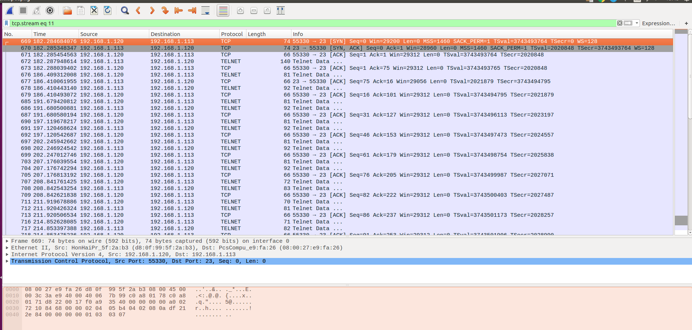
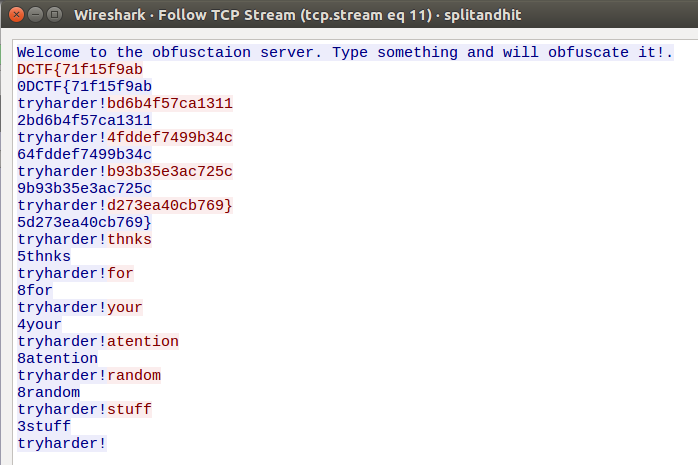

## HitandSplit

### Description:
Are you a forensic?

### Author: 
Lucian Nitescu

### Stats: 
2 points / 227 solvers

### Solution:  

You download the "splitandhit.pcapng" file and open it with wireshark and then you search for tcp stream number 11 (filter: tcp.stream eq 11).

At this point we observe that the "victim" of the "mitm attack" is speaking with a remote server over telnet and we only need to get the user input (red color strings in wireshark) to the server because the server responded with a random number before the string an with "tryharder!" on the next line.

The flag is: 

DCTF{71f15f9abbd6b4f57ca13114fddef7499b34cb93b35e3ac725cd273ea40cb769}
