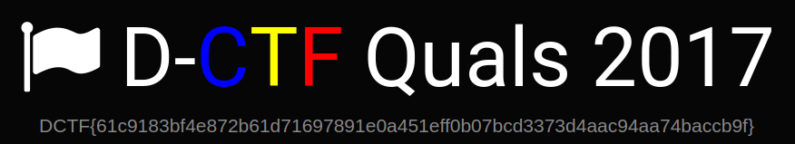

## Inception

### Description:
Do you like our logo?

### Author: 
Lucian Nitescu

### Stats: 
2 points / 198 solvers

### Solution:  

First of all let's download the logo from https://dctf.def.camp/quals-2017-kalskflsafkl/Youmaynotseeme.png.

```
mehuser:~$ wget https://dctf.def.camp/quals-2017-kalskflsafkl/Youmaynotseeme.png
--2017-10-02 16:35:45--  https://dctf.def.camp/quals-2017-kalskflsafkl/Youmaynotseeme.png
Resolving dctf.def.camp (dctf.def.camp)... 108.61.199.109
Connecting to dctf.def.camp (dctf.def.camp)|108.61.199.109|:443... connected.
HTTP request sent, awaiting response... 200 OK
Length: 271753 (265K) [image/png]
Saving to: ‘Youmaynotseeme.png’

Youmaynotseeme.png  100%[===================>] 265,38K  1,25MB/s    in 0,2s    

2017-10-02 16:35:46 (1,25 MB/s) - ‘Youmaynotseeme.png’ saved [271753/271753]

```

After that let's binwalk!

```
mehuser:~$ binwalk ./Youmaynotseeme.png 

DECIMAL       HEXADECIMAL     DESCRIPTION
--------------------------------------------------------------------------------
0             0x0             PNG image, 895 x 157, 8-bit/color RGB, non-interlaced
20491         0x500B          PNG image, 895 x 157, 8-bit/color RGB, non-interlaced
40982         0xA016          PNG image, 895 x 157, 8-bit/color RGB, non-interlaced
61473         0xF021          PNG image, 895 x 157, 8-bit/color RGB, non-interlaced
81964         0x1402C         PNG image, 895 x 157, 8-bit/color RGB, non-interlaced
102455        0x19037         PNG image, 895 x 157, 8-bit/color RGB, non-interlaced
122946        0x1E042         PNG image, 876 x 159, 8-bit/color RGB, non-interlaced
148807        0x24547         PNG image, 895 x 157, 8-bit/color RGB, non-interlaced
169298        0x29552         PNG image, 895 x 157, 8-bit/color RGB, non-interlaced
189789        0x2E55D         PNG image, 895 x 157, 8-bit/color RGB, non-interlaced
210280        0x33568         PNG image, 895 x 157, 8-bit/color RGB, non-interlaced
230771        0x38573         PNG image, 895 x 157, 8-bit/color RGB, non-interlaced
251262        0x3D57E         PNG image, 895 x 157, 8-bit/color RGB, non-interlaced

```

At this point we can observe that our image contains more then one image and that "122946 0x1E042 PNG image, 876 x 159, 8-bit/color RGB, non-interlaced" is diffrent. So let's extract:

```
mehuser:~$ binwalk -D 'png image:png' Youmaynotseeme.png 

DECIMAL       HEXADECIMAL     DESCRIPTION
--------------------------------------------------------------------------------
0             0x0             PNG image, 895 x 157, 8-bit/color RGB, non-interlaced
20491         0x500B          PNG image, 895 x 157, 8-bit/color RGB, non-interlaced
40982         0xA016          PNG image, 895 x 157, 8-bit/color RGB, non-interlaced
61473         0xF021          PNG image, 895 x 157, 8-bit/color RGB, non-interlaced
81964         0x1402C         PNG image, 895 x 157, 8-bit/color RGB, non-interlaced
102455        0x19037         PNG image, 895 x 157, 8-bit/color RGB, non-interlaced
122946        0x1E042         PNG image, 876 x 159, 8-bit/color RGB, non-interlaced
148807        0x24547         PNG image, 895 x 157, 8-bit/color RGB, non-interlaced
169298        0x29552         PNG image, 895 x 157, 8-bit/color RGB, non-interlaced
189789        0x2E55D         PNG image, 895 x 157, 8-bit/color RGB, non-interlaced
210280        0x33568         PNG image, 895 x 157, 8-bit/color RGB, non-interlaced
230771        0x38573         PNG image, 895 x 157, 8-bit/color RGB, non-interlaced
251262        0x3D57E         PNG image, 895 x 157, 8-bit/color RGB, non-interlaced
```

Now let's see the different image!



Flag is: DCTF{61c9183bf4e872b61d71697891e0a451eff0b07bcd3373d4aac94aa74baccb9f}