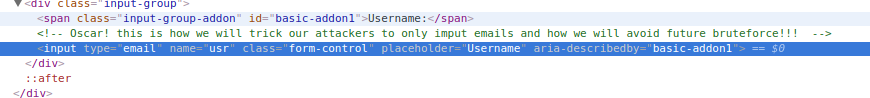

## Super Secure

### Description:
Oscar is more of an offline type of guy. Can you hack in his platform? 

### Author: 
Lucian Nitescu

### Stats: 
1 point / 344 solvers

### Solution:  

The challenge started with this link: [https://junior1.dctf-quals-17.def.camp/](https://junior1.dctf-quals-17.def.camp/).

First you have to press ctrl + u to open the page source code and there you should observe that the authentication formular is using a javascript.

The script is:

When you will use the username and password you will observe that you have to bypass the frontend interface:

Here is the code with inspector:

Here is after we edit it:

After login:

At this point you must close your internet connection. Literally close the internet!

Well, at this point you got your flag! But, I heard a lot of people complaining that the entire flag is not displayed.

At this point you have to reconnect to the internet and go to the page CSS which is displayed at the offline check.

DCTF{76c77d557198ff760ab9866ad1261a01a7298c349617cc4557462f80500d56a7}
