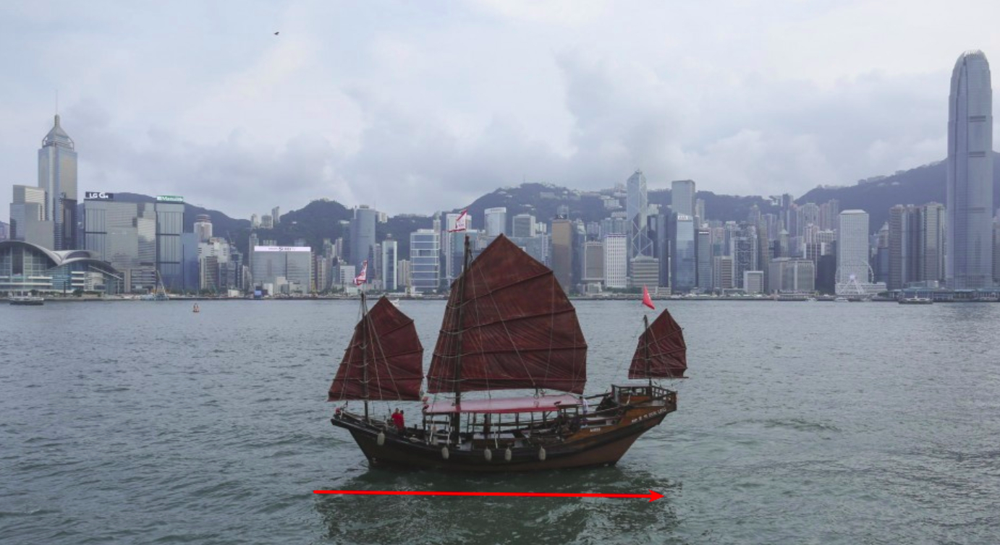

## Working Junks

### Description:
https://snag.gy/1hqQnF.jpg 

### Author: 
Lucian Nitescu

### Stats: 
162 points / 55 solvers

### Solution:  

First of all the above given description is a reference to the junk (the ship/boat) and the red line below is a reference to the "in reverse". 



The challenge start with:

```
mehuser:~$ file e
e: ELF 64-bit LSB executable, x86-64, version 1 (SYSV), dynamically linked, interpreter /lib64/ld-linux-x86-64.so.2, for GNU/Linux 2.6.32, BuildID[sha1]=20712db5ad286fbbcfe0005d23d8cbcc3965cffa, not stripped
```

After we run this 64-bit ELF we got three things (hints):

```
mehuser:~$ chmod +x ./e
mehuser:~$ ./e
?em wonk uoy oD !!!olleH
!sdnatsrednu eno on taht yrots gib a evah I dnA !RACIE si eman yM
!edoc ym si siht dnA
*H+H$!ELIF-TSET-SURIVITNA-DRADNATS-RACIE$}7)CC7)^P(45XZP4[PA@P!O5XX5O!P%@AP[4PZX54(P^)7CC)7}$EICAR-STANDARD-ANTIVIRUS-TEST-FILE!$H+H*~jn

~cb|6o
f

f
jo`aff
m}mlqoqo%|
u

 
u
    

u
 

  uy|sr
7Z N?J/.?4[?57Z[G?1FX,,FXK*&,.=B<;.!+.=+B.!;&9&=:<B;*<;B)&#*NK'D'E
X5O!P
3.000000, 4.000000, 5.000000 


<snip of more junks>

```
1. We have junk, intended junk.
2. We have strings in reverse.
3. We have an eicar code missing characters because of "\" (you can check with strings also)


Reverse everything in python with this script:

```
# 1.py
f = open("e", "r")
buf = f.read()
f.close()
buf = buf.encode("hex")
buf = buf[::-1]
f = open("sol", "w")
f.write(buf.decode("hex"))
f.close()

```
And then use binwalk to extract something from the junk!

```
mehuser:~$ python ./rev.py 
mehuser:~$ binwalk sol

DECIMAL       HEXADECIMAL     DESCRIPTION
--------------------------------------------------------------------------------
11576         0x2D38          PNG image, 862 x 171, 8-bit/color RGB, non-interlaced
```

So we got to extract a PNG file that was stored in a string (reversed hex dump of the PNG file) in the first place.


The flag is: DCTF{63a47eb3bcfade799a44e0560e891c25029e442e538276fb403975d18f93d88e}